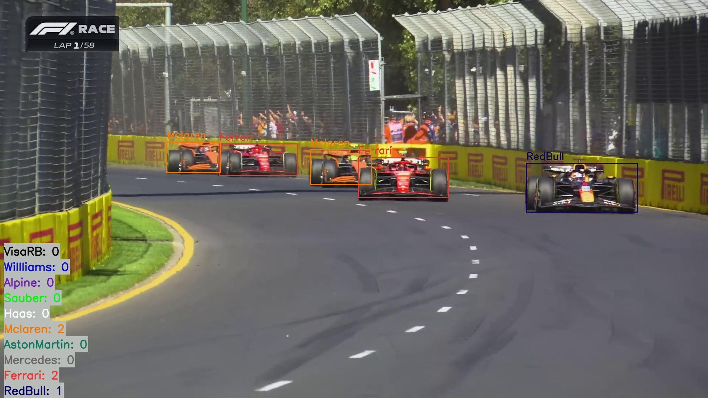
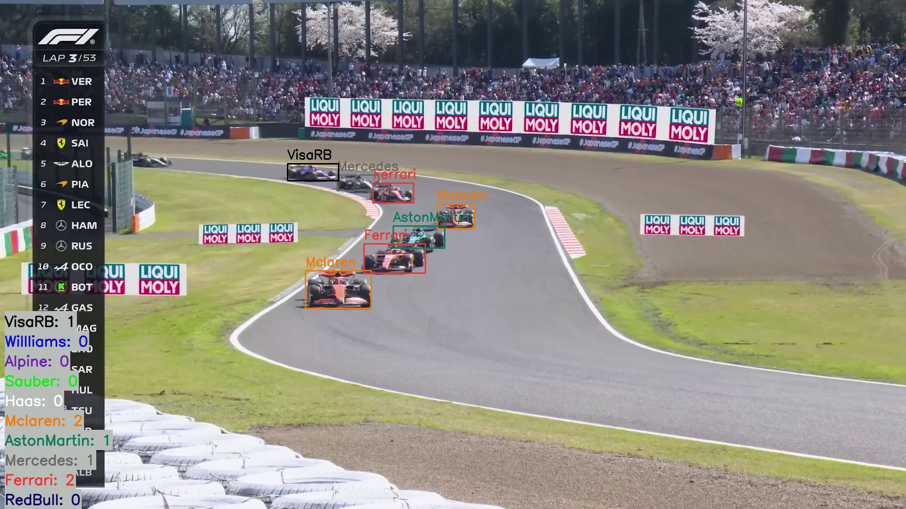
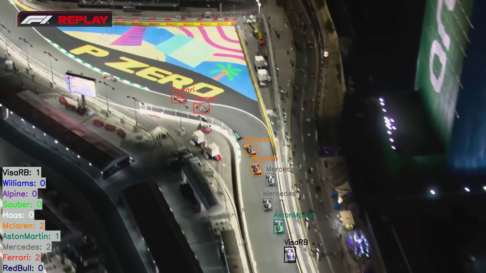
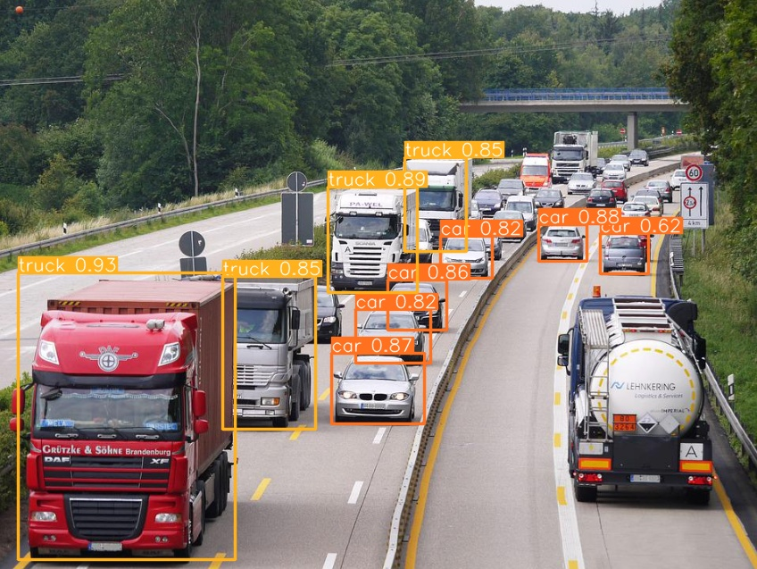
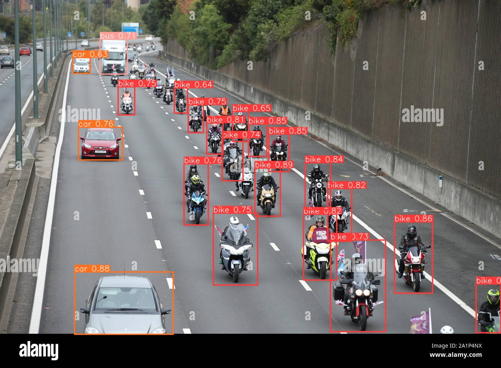

# Using YOLOv8 Neural Networks for Object Detection in Images

## Project Description
This project was conducted as part of the **"Individual Project"** course and aimed to apply the YOLOv8 neural network for object detection in images. The project involved analyzing two datasets:

1. **Kaggle Dataset**: Containing images of cars, buses, trucks, and bikes.
2. **Custom Dataset**: Comprising images of Formula 1 cars, created and curated myself.

The project included data preprocessing, training the YOLOv8 model, as well as validating and evaluating detection results.

## Project Outcomes

